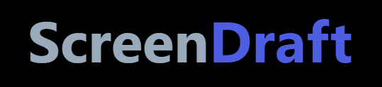
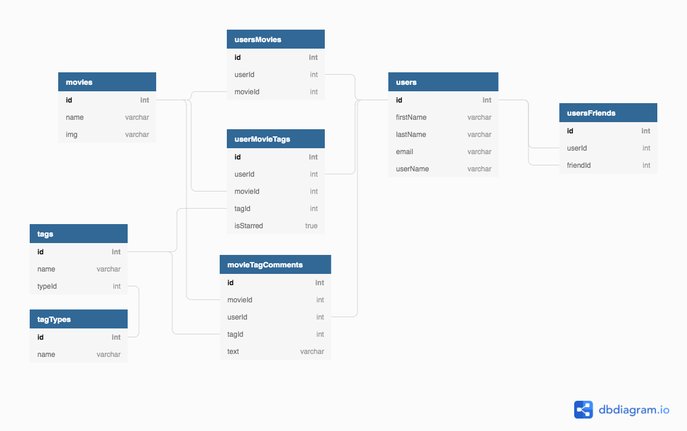

# Screen Draft

**Screen Draft** is a social film discovery platform, centered on allowing users to explore films by genre and by their favorite plot conventions (aka. tropes). Users can tag their films with their favorite tropes and discuss their individual validities.     

## Setup
### Local Server

To get the full features from **Screen Draft** you will need to host a server for your database locally.  Using the Node Project Manager (npm) this can be installed with the following command in terminal. 

    npm i -g json-server

Once this is installed run json-server from the projects root directory of the application.

    json-server -p 8088 -w api/db.json

### Project ERD Diagram

